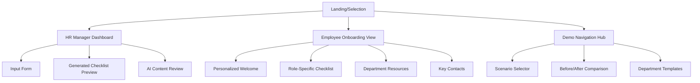
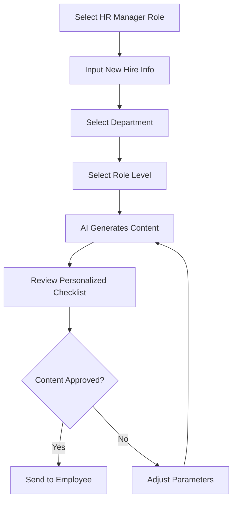
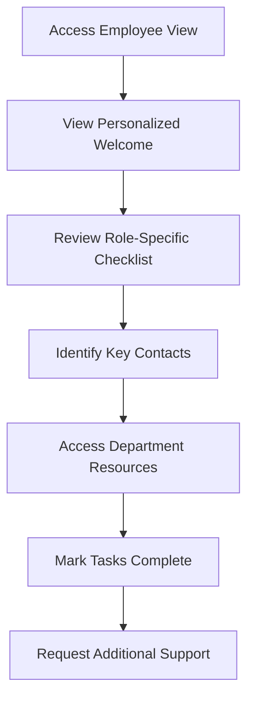
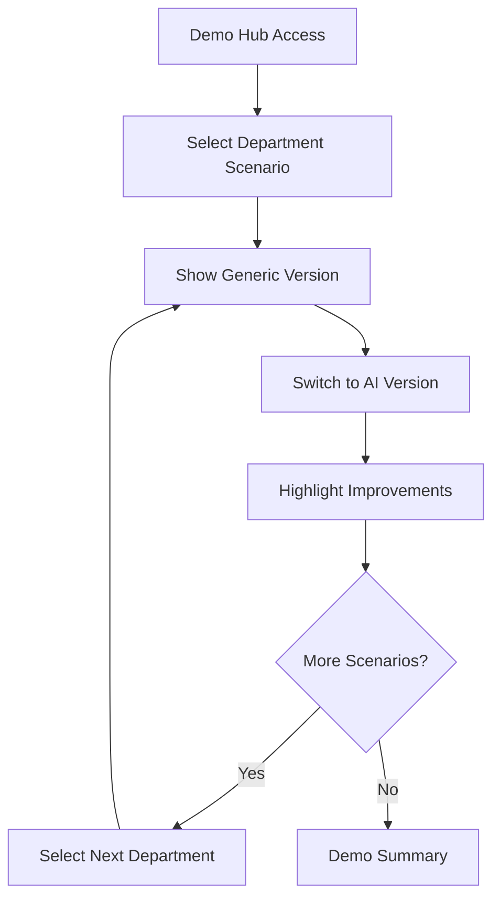

# AI Onboarding Tool UI/UX Specification

This document defines the user experience goals, information architecture, user flows, and visual design specifications for the AI Onboarding Tool's user interface. It serves as the foundation for visual design and frontend development, ensuring a cohesive and user-centered experience leveraging MFUI components and MoneyForward design patterns.

## Introduction

### Overall UX Goals & Principles

#### Target User Personas

**HR Manager:**  
Technical professionals who need efficient tools to customize onboarding experiences quickly. They value precision, consistency, and time-saving automation while maintaining oversight and control over the onboarding process.

**New Employee:**  
Individuals joining MoneyForward departments who need personalized, relevant guidance to integrate quickly. They prioritize clarity, relevance, and a welcoming experience that reduces anxiety and accelerates productivity.

**Demo Presenter/Hackathon Judge:**  
Technical evaluators who need to see clear value proposition and innovation in under 5 minutes. They value compelling before/after demonstrations and polished user experiences.

#### Usability Goals

- **Ease of learning:** HR managers can generate personalized onboarding in under 30 seconds
- **Efficiency of use:** New employees can identify key tasks and contacts within 2 minutes
- **Error prevention:** Clear visual indicators prevent confusion between AI-generated and generic content
- **Memorability:** Demo scenarios are immediately understandable and leave lasting impression
- **Demo impact:** Judges can evaluate innovation and practical value within presentation timeframe

#### Design Principles

1. **MFUI Component Consistency** - Leverage proven MoneyForward components over custom solutions for familiar, reliable interactions
2. **AI Value Transparency** - Make AI personalization benefits immediately obvious through clear visual differentiation
3. **Dual-Purpose Design** - Optimize for both functional use and compelling demo presentation
4. **Progressive Disclosure** - Show relevant information based on role and department selection
5. **Immediate Feedback** - Every selection provides instant visual confirmation of personalization

#### Change Log

| Date | Version | Description | Author |
|------|---------|-------------|---------|
| 2025-08-14 | 1.0 | Initial specification creation | Maya (MFUI UX Expert) |

## Information Architecture (IA)

### Site Map / Screen Inventory

### Navigation Structure

**Primary Navigation:** Role-based tabbed interface switching between HR Manager and Employee views with clear visual indicators

**Secondary Navigation:** Within-role navigation using MFUI SubNavigation for accessing different sections (Welcome, Checklist, Resources, Contacts)

**Breadcrumb Strategy:** Simple breadcrumb showing current role view and section, using MFUI navigation patterns

## User Flows

### HR Manager - Generate Personalized Onboarding

**User Goal:** Quickly create customized onboarding experience for new hire

**Entry Points:** Landing page role selection or direct HR Dashboard access

**Success Criteria:** Generated personalized checklist reviewed and ready for new hire in under 60 seconds

#### Flow Diagram

#### Edge Cases & Error Handling:
- Missing department/role selection → Clear validation message with MFUI HelpMessage component
- Invalid employee data → Graceful fallback to generic template with clear indication
- Demo mode interruption → Auto-save state and resume capability

**Notes:** Flow optimized for demo presentation with pre-loaded data scenarios

### New Employee - Experience Personalized Onboarding

**User Goal:** Understand role expectations and complete onboarding tasks efficiently

**Entry Points:** Direct link from HR manager or landing page employee selection

**Success Criteria:** Clear understanding of role-specific requirements and key contacts within first session

#### Flow Diagram

#### Edge Cases & Error Handling:
- No personalized content available → Show generic version with clear explanation
- Missing contact information → Provide HR fallback contact
- Mobile access issues → Responsive design ensures full functionality

**Notes:** Emphasizes welcoming, anxiety-reducing experience with clear progress indicators

### Demo Presentation Flow

**User Goal:** Effectively demonstrate AI personalization value to hackathon judges

**Entry Points:** Demo navigation hub with scenario selection

**Success Criteria:** Clear before/after comparison shown, multiple scenarios demonstrated, value proposition understood

#### Flow Diagram

#### Edge Cases & Error Handling:
- Scenario loading delays → Skeleton loading states using MFUI components
- Navigation confusion → Clear demo controls and keyboard shortcuts
- Technical presentation issues → Fallback static screenshots embedded

**Notes:** Optimized for keyboard navigation and smooth transitions between scenarios

## Wireframes & Mockups

**Primary Design Files:** Interactive Figma prototype linked to MFUI component library (to be created)

### Key Screen Layouts

#### Landing/Selection Screen

**Purpose:** Allow users to select their role and drive personalization scenarios

**Key Elements:**
- MFUI PageHeader with clear application branding
- Two prominent MFUI Button components for role selection (HR Manager/Employee)
- Department/role selector using MFUI SelectBox components
- Demo navigation using MFUI SubNavigation

**Interaction Notes:** Immediate visual feedback on selection with smooth transitions using MFUI design tokens

**Design File Reference:** [Figma Frame: Landing-Selection]

#### HR Manager Dashboard

**Purpose:** Efficient input interface for generating personalized onboarding

**Key Elements:**
- MFUI Panel components organizing input sections
- MFUI KeyValue layout for form structure
- MFUI TextBox, SelectBox for employee data input
- MFUI DataGrid for checklist preview
- MFUI Button components for primary actions

**Interaction Notes:** Live preview updates using MFUI ProgressIndicator during generation, clear success states

**Design File Reference:** [Figma Frame: HR-Dashboard]

#### Employee Onboarding View

**Purpose:** Welcoming, personalized experience for new hires

**Key Elements:**
- MFUI PageHeader with personalized welcome message
- MFUI Panel containing role-specific checklist
- MFUI Badge/Tag components for task status
- MFUI DisplayTable for key contacts
- MFUI TextLink components for resource access

**Interaction Notes:** Checkbox interactions with immediate visual feedback, progress tracking

**Design File Reference:** [Figma Frame: Employee-View]

## Component Library / Design System

**Design System Approach:** Full adoption of MFUI React component library with MoneyForward design tokens, ensuring consistency with existing MoneyForward products

### Core Components

#### MFUI Layout Components
**Purpose:** Structure and organize content using proven MoneyForward patterns
**Variants:** Panel, VStack/HStack, PageHeader, KeyValue
**States:** Default, loading, error
**Usage Guidelines:** Always use Stack components for spacing instead of custom CSS, maintain consistent padding through Panel components

#### MFUI Form Controls
**Purpose:** Handle all user input with accessible, consistent interactions
**Variants:** TextBox, SelectBox, MultipleSelectBox, DatePicker, Button variations
**States:** Default, hovered, focused, disabled, error, success
**Usage Guidelines:** Use semantic form components over generic HTML elements, include proper validation states

#### MFUI Data Display
**Purpose:** Present information clearly using MoneyForward's established patterns
**Variants:** DataGrid, DisplayTable, Badge, StatusLabel, Typography variants
**States:** Loading (Skeleton), populated, empty, error
**Usage Guidelines:** Choose DataGrid for interactive tables, DisplayTable for read-only data

#### MFUI Navigation
**Purpose:** Provide consistent navigation experiences
**Variants:** MainNavigation, SubNavigation, Tabs, TextLink
**States:** Default, active, hover, focus
**Usage Guidelines:** Follow established navigation hierarchy, use TextLink for all clickable text

#### MFUI Feedback Components
**Purpose:** Communicate system state and user feedback
**Variants:** Toast, Dialog, SidePane, HelpMessage, SectionMessage
**States:** Success, error, warning, info
**Usage Guidelines:** Use appropriate severity levels, position feedback contextually

## Branding & Style Guide

### Visual Identity
**Brand Guidelines:** Full compliance with MoneyForward brand guidelines and MFUI design tokens

### Color Palette

| Color Type | Hex Code | Usage |
|------------|----------|-------|
| Primary | #1E88E5 (MFUI blue-49) | Primary actions, key interactive elements |
| Secondary | #546E7A (MFUI neutral tones) | Secondary actions, supporting content |
| Accent | #4CAF50 (MFUI signal-green) | Success states, positive feedback |
| Success | #4CAF50 | Positive feedback, confirmations |
| Warning | #FF9800 | Cautions, important notices |
| Error | #F44336 | Errors, destructive actions |
| Neutral | MFUI neutral scale | Text, borders, backgrounds |

### Typography

#### Font Families
- **Primary:** MFUI system font stack (optimized for business applications)
- **Secondary:** Fallback web fonts per MFUI specifications
- **Monospace:** MFUI monospace stack for code/data display

#### Type Scale

| Element | Size | Weight | Line Height |
|---------|------|--------|-------------|
| H1 | MFUI pageHeading1 | Bold | 1.2 |
| H2 | MFUI pageHeading2 | Bold | 1.3 |
| H3 | MFUI sectionHeading | Medium | 1.4 |
| Body | MFUI body | Regular | 1.5 |
| Small | MFUI helpMessage | Regular | 1.4 |

### Iconography
**Icon Library:** MFUI icon system with MoneyForward semantic icons

**Usage Guidelines:** Use semantic icons consistently, maintain icon-text spacing using MFUI spacing tokens

### Spacing & Layout
**Grid System:** MFUI layout grid with 14px horizontal base and 24px vertical base

**Spacing Scale:** Semantic MFUI spacing tokens including paragraph.vertical, icon-and-text.horizontal, key-value.horizontal

## Accessibility Requirements

### Compliance Target
**Standard:** WCAG 2.2 Level A compliance, aligned with MFUI accessibility standards

### Key Requirements

**Visual:**
- Color contrast ratios: MFUI compliant ratios (4.5:1 minimum for normal text)
- Focus indicators: MFUI FocusIndicator component usage throughout
- Text sizing: MFUI typography tokens ensure readable sizes

**Interaction:**
- Keyboard navigation: Full keyboard support using MFUI component patterns
- Screen reader support: Semantic HTML and ARIA attributes via MFUI components
- Touch targets: MFUI button minimum touch target requirements (44px minimum)

**Content:**
- Alternative text: Descriptive alt text for all images and icons
- Heading structure: Proper H1-H6 hierarchy using MFUI Heading component
- Form labels: Proper labels and help text using MFUI form components

### Testing Strategy
Accessibility testing using axe-core integration, screen reader testing with NVDA/JAWS, keyboard navigation verification across all flows

## Responsiveness Strategy

### Breakpoints

| Breakpoint | Min Width | Max Width | Target Devices |
|------------|-----------|-----------|----------------|
| Mobile | 320px | 767px | Smartphones |
| Tablet | 768px | 1023px | Tablets |
| Desktop | 1024px | 1440px | Standard screens |
| Wide | 1441px | - | Large displays |

### Adaptation Patterns

**Layout Changes:** MFUI responsive Stack components automatically adapt, DataGrid switches to mobile-friendly card layout

**Navigation Changes:** MainNavigation collapses to hamburger menu, SubNavigation becomes horizontal scrolling on mobile

**Content Priority:** Less critical content hidden on mobile, essential information remains prominent

**Interaction Changes:** Touch-optimized button sizing, improved spacing for mobile interaction

## Animation & Micro-interactions

### Motion Principles
Subtle, purposeful animations that enhance understanding without distraction. Use MFUI motion tokens for consistent timing and easing.

### Key Animations
- **Role Selection:** Smooth transition between HR and Employee views (Duration: 300ms, Easing: ease-out)
- **Content Generation:** Loading indicator during AI content generation (Duration: 2s loop, Easing: linear)
- **Checklist Updates:** Checkbox state changes with subtle confirmation (Duration: 150ms, Easing: ease-in)
- **Navigation Transitions:** Tab switching and page transitions (Duration: 200ms, Easing: ease-in-out)

## Performance Considerations

### Performance Goals
- **Page Load:** Initial view renders within 1 second for demo smoothness
- **Interaction Response:** Button clicks and form updates respond within 100ms
- **Animation FPS:** All animations maintain 60fps for professional presentation

### Design Strategies
Lazy loading of secondary content, optimized asset loading, efficient MFUI component usage patterns, minimize large image assets

## Next Steps

### Immediate Actions
1. Create detailed Figma prototype using MFUI component library
2. Set up development environment with MFUI React components
3. Implement responsive breakpoints and test on target devices
4. Create accessibility testing checklist based on MFUI standards
5. Develop content strategy for demo scenarios
6. Plan usability testing sessions with target personas

### Design Handoff Checklist
- [x] All user flows documented with MFUI component specifications
- [x] Component inventory complete with specific MFUI components identified
- [x] Accessibility requirements defined using MFUI standards
- [x] Responsive strategy clear with MFUI breakpoint system
- [x] Brand guidelines incorporated through MFUI design tokens
- [x] Performance goals established for demo presentation

### Recommended MFUI Components for Implementation

**Layout Foundation:**
- `Panel` for content grouping
- `VStack`/`HStack` for consistent spacing
- `PageHeader` for all page headers
- `KeyValue` for form layouts

**Core Interactions:**
- `Button` and `IconButton` for all actions
- `SelectBox` for department/role selection
- `TextBox` for employee input
- `DataGrid` for checklist management

**Content Display:**
- `Typography` with semantic variants
- `Badge`/`StatusLabel` for status indication
- `DisplayTable` for contact information
- `Tag` for categorization

**User Feedback:**
- `Toast` for notifications
- `HelpMessage` for validation
- `ProgressIndicator` for loading states
- `Dialog` for confirmations

This specification ensures the AI Onboarding Tool leverages MoneyForward's proven design system while creating a compelling demonstration of AI personalization value.