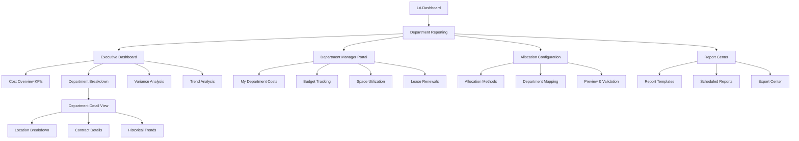
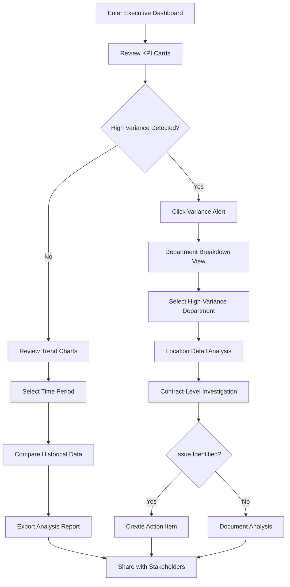
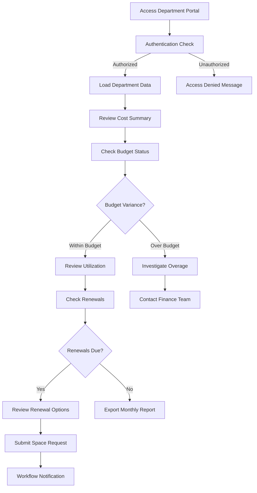
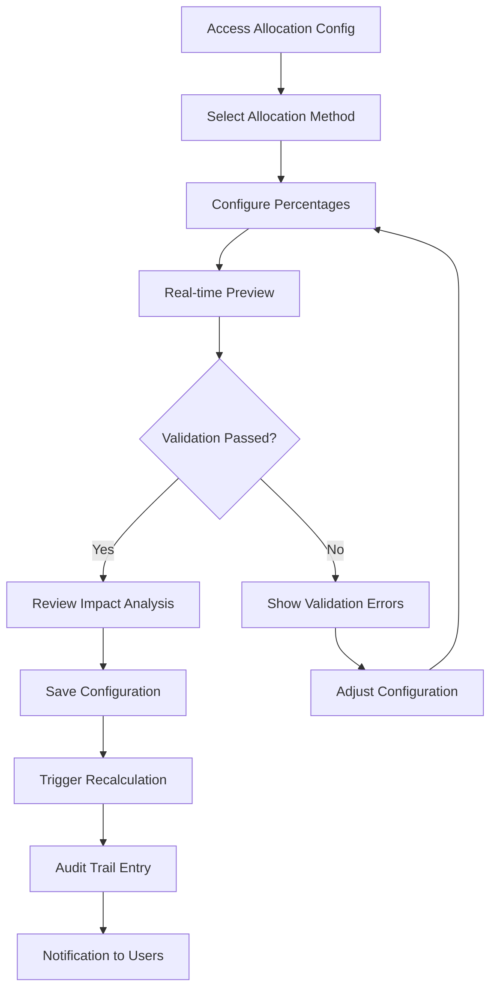

# Department-Level Reporting & Cost Center Allocation - MFUI Frontend Specification

## Introduction

This document defines the user experience goals, information architecture, user flows, and MFUI component specifications for the Department-Level Reporting & Cost Center Allocation feature. It serves as the foundation for frontend development using MoneyForward's proven MFUI design system and established LA Frontend patterns.

### Overall UX Goals & Principles

#### Target User Personas

**Finance Director (Sarah)**: Senior finance professional who needs comprehensive cost visibility, executive reporting capabilities, and strategic decision-making tools. Requires high-level dashboards with drill-down capability and professional export formats.

**Department Manager (Mike)**: Department head who needs self-service access to their department's lease costs, budget tracking, and space utilization metrics. Values simplicity and quick access to actionable insights.

**System Administrator**: Technical user who configures cost allocation methodologies, manages user access, and ensures system performance. Needs powerful configuration tools and detailed system visibility.

**Real Estate Manager (Lisa)**: Space optimization specialist who needs portfolio-wide analytics, scenario modeling capabilities, and consolidation recommendations. Requires advanced analytics and visualization tools.

#### Usability Goals

- **Rapid Decision Making**: Finance Directors can access key insights within 15 seconds of login
- **Self-Service Efficiency**: Department Managers can find their cost information without training or support
- **Configuration Simplicity**: System Administrators can set up allocation rules with visual feedback and validation
- **Expert Analysis**: Real Estate Managers can perform complex scenario modeling with intuitive interfaces

#### Design Principles

1. **MFUI Component Consistency** - Use semantic MFUI components exclusively to maintain MoneyForward design coherence
2. **LA Frontend Pattern Reuse** - Leverage proven patterns from LA Frontend for familiar user experiences
3. **Data-First Design** - Prioritize data visibility and actionability over visual complexity
4. **Progressive Disclosure** - Show essential information first, with drill-down access to details
5. **Mobile-First Responsiveness** - Ensure full functionality across all device sizes using MFUI responsive patterns

### Change Log

| Date | Version | Description | Author |
|------|---------|-------------|---------|
| 2025-08-14 | 1.0 | Initial MFUI specification creation | Maya (MFUI UX Expert) |

## Information Architecture (IA)

### Site Map / Screen Inventory



### Navigation Structure

**Primary Navigation:** Extends existing LA Frontend MainNavigation with "Department Reporting" section

**Secondary Navigation:** Uses MFUI SubNavigation with tabs for Executive Dashboard, Department Portal, Configuration, and Reports

**Breadcrumb Strategy:** MFUI breadcrumb navigation pattern: LA Dashboard > Department Reporting > [Current Section] > [Detail View]

## User Flows

### Executive Cost Analysis Flow

**User Goal:** Finance Director needs to analyze Q4 lease costs and identify optimization opportunities

**Entry Points:** 
- LA Dashboard "Department Reporting" card
- Direct navigation to /department-reporting/executive

**Success Criteria:** 
- Can identify cost variances within 30 seconds
- Can drill down to contract-level details
- Can export executive summary for board presentation

#### Flow Diagram



**Edge Cases & Error Handling:**
- Data loading failure: Display MFUI SectionMessage with retry option
- No allocation data: Show EmptyContentMessage with configuration link
- Export timeout: Progress indicator with background processing notification
- Insufficient permissions: Access control with clear messaging and escalation path

### Department Manager Self-Service Flow

**User Goal:** Department Manager needs to review monthly lease costs and plan for upcoming renewals

**Entry Points:**
- Direct portal URL /department-reporting/my-department
- Email notification with cost report link

**Success Criteria:**
- Can view department costs within 15 seconds
- Can identify upcoming lease renewals
- Can request space changes through workflow

#### Flow Diagram



**Edge Cases & Error Handling:**
- Department data not found: EmptyContentMessage with admin contact
- Budget allocation pending: StatusLabel indicating processing state
- Renewal deadline missed: Warning SectionMessage with urgent action items

### Allocation Configuration Flow

**User Goal:** System Administrator needs to set up cost allocation rules for new fiscal year

**Entry Points:**
- Configuration menu in Department Reporting section
- Admin dashboard allocation setup card

**Success Criteria:**
- Can configure allocation methods with real-time preview
- Can validate allocations sum to 100%
- Can save configuration with audit trail

#### Flow Diagram



**Edge Cases & Error Handling:**
- Calculation service unavailable: Graceful degradation with manual override option
- Invalid percentage total: Inline validation with MFUI HelpMessage
- Department mapping conflicts: Toast notification with resolution options

## Wireframes & Mockups

**Primary Design Files:** Figma workspace: [MoneyForward LA Department Reporting](link-to-figma)

### Key Screen Layouts

#### Executive Dashboard Layout

**Purpose:** Provide high-level cost visibility and variance alerts for finance directors

**Key MFUI Components:**
- `PageLayout` with `PageLayout.Header` for consistent page structure
- `Panel` containers for KPI card groups
- `DataGrid` for department cost breakdown table
- `StatusLabel` and `Badge` components for variance indicators
- `Button` components for primary actions (Export, Configure)

**Layout Pattern:** Follows LA Frontend dashboard pattern with KPI cards in top row, main data table below, and secondary panels in sidebar

**MFUI Implementation:**
```jsx
<PageLayout
  headerSlot={
    <PageLayout.Header
      headingSlot="Department Cost Overview"
      actionSlot={
        <HStack gap={8}>
          <Button priority="secondary">Export Report</Button>
          <Button priority="primary">Configure Allocation</Button>
        </HStack>
      }
    />
  }
>
  <VStack gap={24}>
    {/* KPI Cards Row */}
    <HStack gap={16}>
      <Panel className={styles.kpiCard}>
        <VStack gap={8}>
          <Typography variant="amount">$2.4M</Typography>
          <Typography variant="body">Total Lease Costs</Typography>
          <StatusLabel status="warning">5.2% Over Budget</StatusLabel>
        </VStack>
      </Panel>
      {/* Additional KPI cards */}
    </HStack>
    
    {/* Department Breakdown Table */}
    <Panel>
      <DataGrid layout="edge-to-edge" fixedHeader>
        {/* Table implementation */}
      </DataGrid>
    </Panel>
  </VStack>
</PageLayout>
```

#### Department Manager Portal Layout

**Purpose:** Self-service portal for department managers to view their lease footprint

**Key MFUI Components:**
- `Tabs` for organizing different views (Costs, Budget, Renewals)
- `KeyValue` components for cost breakdowns
- `ProgressIndicator` for budget utilization
- `Badge` components for status indicators

**Layout Pattern:** Follows LA Frontend portal pattern with tabbed interface and key-value data presentation

#### Allocation Configuration Interface

**Purpose:** Interactive tool for configuring cost allocation methodologies

**Key MFUI Components:**
- `SelectBox` for allocation method selection
- `MultipleSelectBox` for department selection
- Percentage sliders using custom components built on MFUI patterns
- `Toast` notifications for validation feedback
- `SidePane` for configuration preview

**Layout Pattern:** Master-detail interface with configuration form on left and real-time preview on right

## Component Library / Design System

**Design System Approach:** Leverage existing MFUI component library with minimal custom components. All custom components follow MFUI patterns and use design tokens.

### Core Components

#### AllocationPreviewCard

**Purpose:** Display real-time cost allocation preview during configuration

**MFUI Foundation:** Built using `Panel`, `Typography`, `Badge`, and design tokens

**Variants:** Summary view, detailed breakdown view

**States:** Loading, calculated, error

**Usage Guidelines:** Always show validation status, use semantic colors for feedback, include tooltips for complex calculations

#### DepartmentCostTable

**Purpose:** Specialized DataGrid for department cost display with built-in actions

**MFUI Foundation:** Extends MFUI `DataGrid` with custom cell renderers

**Variants:** Executive view (all departments), manager view (single department)

**States:** Loading skeleton, populated, empty, error

**Usage Guidelines:** Fixed header for large datasets, exportable data, drill-down navigation

#### CostTrendChart

**Purpose:** Interactive chart component for cost trend analysis

**MFUI Foundation:** Uses MFUI layout components (`Panel`, `Stack`) with chart library integration

**Variants:** Line chart, bar chart, comparison chart

**States:** Loading, populated, no data

**Usage Guidelines:** Consistent with MFUI color tokens, responsive design, accessible chart patterns

## Branding & Style Guide

### Visual Identity

**Brand Guidelines:** Follows MoneyForward Brand Guidelines v3.0 and MFUI design tokens

### Color Palette

| Color Type | MFUI Token | Usage |
|------------|------------|-------|
| Primary | blue-49 | Primary actions, links, focus states |
| Success | signal-green | Budget compliance, successful operations |
| Warning | signal-yellow | Budget variances, attention needed |
| Error | signal-red | Over budget, errors, destructive actions |
| Neutral | neutral-* scale | Text, borders, backgrounds |

### Typography

#### Font Families
- **Primary:** MFUI system font stack
- **Secondary:** MFUI secondary font for data display
- **Monospace:** MFUI monospace for numerical data

#### Type Scale

| Element | MFUI Token | Weight | Usage |
|---------|------------|---------|-------|
| Page Heading | page-heading-1 | Medium | Page titles |
| Section Heading | section-heading | Regular | Section titles |
| Content Heading | content-heading | Regular | Subsection titles |
| Body | body | Regular | Standard text |
| Amount | amount | Medium | Financial figures |

### Iconography

**Icon Library:** MFUI icon set with MoneyForward custom financial icons

**Usage Guidelines:** 24px for primary actions, 16px for inline text, semantic usage aligned with MFUI patterns

### Spacing & Layout

**Grid System:** MFUI layout grid with 14px horizontal and 24px vertical base

**Spacing Scale:** Semantic MFUI spacing tokens (paragraph.vertical, key-value.horizontal, etc.)

## Accessibility Requirements

### Compliance Target

**Standard:** WCAG 2.2 Level AA compliance, following MFUI accessibility patterns

### Key Requirements

**Visual:**
- Color contrast ratios: 4.5:1 minimum for normal text, 3:1 for large text
- Focus indicators: MFUI FocusIndicator component for all interactive elements
- Text sizing: Scalable up to 200% without horizontal scrolling

**Interaction:**
- Keyboard navigation: Full keyboard access to all functionality
- Screen reader support: Semantic HTML with appropriate ARIA labels
- Touch targets: Minimum 44px tap targets for mobile interfaces

**Content:**
- Alternative text: Descriptive alt text for charts and data visualizations
- Heading structure: Logical h1-h6 hierarchy using MFUI Heading component
- Form labels: Explicit labels for all form controls using MFUI patterns

### Testing Strategy

Automated accessibility testing integrated with existing LA Frontend testing patterns, manual testing with screen readers, and keyboard navigation validation.

## Responsiveness Strategy

### Breakpoints

| Breakpoint | Min Width | Max Width | Target Devices | MFUI Approach |
|------------|-----------|-----------|----------------|---------------|
| Mobile | 320px | 767px | Smartphones | Stack-based layout, collapsed navigation |
| Tablet | 768px | 1023px | Tablets | Mixed layout, side navigation |
| Desktop | 1024px | 1439px | Standard monitors | Full layout, all features |
| Wide | 1440px | - | Large monitors | Enhanced spacing, additional panels |

### Adaptation Patterns

**Layout Changes:** VStack for mobile, HStack combinations for desktop, using MFUI responsive utilities

**Navigation Changes:** MainNavigation collapses to mobile menu, SubNavigation becomes scrollable tabs

**Content Priority:** Essential KPIs always visible, secondary data in collapsible sections

**Interaction Changes:** Touch-friendly controls on mobile, hover states on desktop

## Animation & Micro-interactions

### Motion Principles

Subtle, purposeful animations that enhance usability without distraction. All animations respect user's motion preferences and MFUI motion patterns.

### Key Animations

- **Data Loading:** MFUI Skeleton components with consistent timing (300ms fade-in)
- **Navigation Transitions:** Smooth page transitions using MFUI transition patterns (200ms ease-out)
- **Validation Feedback:** Toast notifications with MFUI animation patterns (slide-in from top)
- **Chart Animations:** Progressive data reveal for trend charts (800ms ease-in-out)

## Performance Considerations

### Performance Goals

- **Page Load:** < 2 seconds for dashboard initial render
- **Interaction Response:** < 100ms for all user interactions
- **Data Refresh:** < 30 seconds for allocation calculations

### Design Strategies

Progressive loading with MFUI Skeleton components, efficient DataGrid virtualization for large datasets, optimized chart rendering with canvas-based visualizations.

## Next Steps

### Immediate Actions

1. Review specification with Finance Director stakeholder for accuracy
2. Validate MFUI component selections with LA Frontend development team
3. Create detailed Figma designs using approved components
4. Plan development sprint breakdown focusing on Epic 1 foundation
5. Set up development environment with MFUI library integration

### Design Handoff Checklist

- [x] All user flows documented with MFUI components
- [x] Component inventory complete using existing MFUI library
- [x] Accessibility requirements defined following MFUI standards
- [x] Responsive strategy clear with MFUI breakpoints
- [x] Brand guidelines incorporated through design tokens
- [x] Performance goals established with realistic targets

## MFUI Integration Summary

This specification leverages the complete MFUI component ecosystem:

**Layout Components:** PageLayout, Panel, VStack, HStack, KeyValue
**Form Components:** SelectBox, MultipleSelectBox, TextBox, Button
**Data Display:** DataGrid, DisplayTable, Typography, Badge, StatusLabel
**Navigation:** MainNavigation, SubNavigation, Tabs, TextLink
**Feedback:** Toast, SectionMessage, HelpMessage, ProgressIndicator

**LA Frontend Patterns Applied:**
- List/Index Page Pattern for department breakdowns
- DataGrid Table Pattern for cost analysis
- CRUD Form Pattern for allocation configuration
- Page Header Pattern for consistent navigation
- SidePane Workflow Pattern for detailed configurations

This specification ensures seamless integration with existing MoneyForward applications while providing the robust functionality required for enterprise lease cost management.