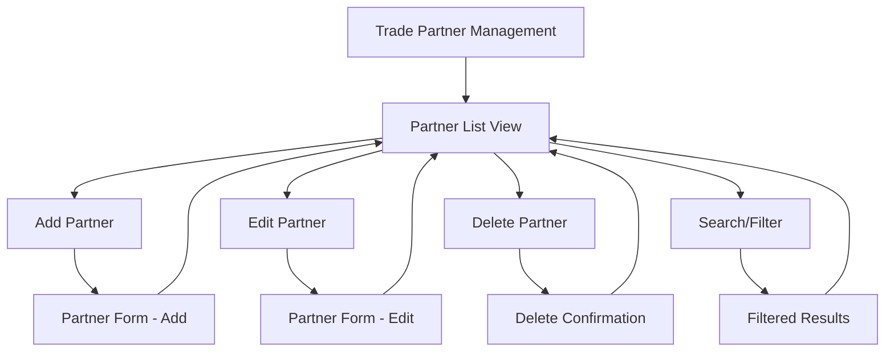
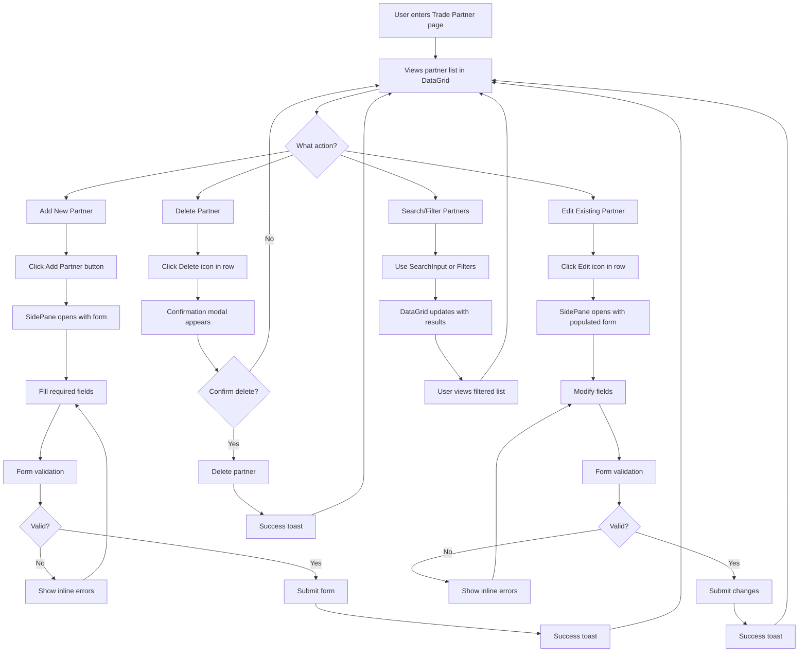

# Epic 1: Trade Partner Foundation - MFUI Frontend Specification

## Introduction

This document defines the MFUI component selection, information architecture, user flows, and design specifications for Epic 1: Trade Partner Foundation's user interface. It leverages MoneyForward's MFUI React UI Library and proven patterns from LA Frontend implementations to ensure consistency with MoneyForward design system.

### Scope: Epic 1 Core CRUD Operations
- Trade Partner list view with search/filter
- Add new partner form with validation  
- Edit existing partner functionality
- Delete partner with confirmation
- Basic error handling and user feedback

## Overall UX Goals & Principles

### Target User Personas
- **Operations Manager**: Business professionals managing trade partner data daily - need efficiency and data accuracy
- **Data Entry Specialist**: Users focused on bulk partner creation/editing - need clear validation and error prevention  
- **Viewer/Auditor**: Read-only users reviewing partner information - need clean data presentation and export capabilities

### Usability Goals
- **Rapid Task Completion**: Core CRUD operations completed in under 60 seconds
- **Error Prevention**: MFUI form validation prevents invalid data entry
- **Visual Consistency**: All components follow MoneyForward design language
- **Data Clarity**: Partner information presented clearly with appropriate MFUI typography and spacing

### Design Principles
1. **MFUI Component-First**: Use proven MFUI components instead of custom solutions
2. **LA Frontend Patterns**: Leverage successful List Page + Side Panel patterns from LA Frontend
3. **Semantic Component Selection**: Choose components based on function, not appearance
4. **MoneyForward Consistency**: Maintain design token compliance throughout
5. **Task-Focused Design**: Prioritize partner management workflow efficiency

### Change Log

| Date | Version | Description | Author |
|------|---------|-------------|---------|
| 2025-08-14 | 1.0 | Initial MFUI specification for Epic 1 | MFUI UX Expert Maya |

## MFUI Component Architecture & LA Frontend Patterns

### Core Component Selection (Based on LA Frontend Success Patterns)

**Primary Layout Pattern: List Page + Side Panel**
- **Container**: `<Page>` component with standard MoneyForward page layout
- **Main Content**: `<DataGrid>` for partner list (proven in LA Frontend for tabular data)
- **Side Panel**: `<SidePane>` for add/edit forms (consistent with LA edit workflows)

### Specific MFUI Component Mappings

#### 1. Trade Partner List View
```typescript
// Primary Components
<DataGrid 
  columns={[
    { key: 'code', title: 'Partner Code', sortable: true },
    { key: 'name', title: 'Partner Name', sortable: true },
    { key: 'displaySetting', title: 'Display', render: StatusBadge },
    { key: 'actions', title: 'Actions', render: ActionButtons }
  ]}
  data={partners}
  selectable={true}
  pagination={true}
/>

// Search & Filter Components
<SearchInput placeholder="Search partners..." />
<FilterDropdown options={displaySettingOptions} />
<Button variant="primary" onClick={handleAdd}>Add Partner</Button>
```

#### 2. Add/Edit Partner Form (Side Panel)
```typescript
<SidePane title={isEdit ? 'Edit Partner' : 'Add Partner'} onClose={handleClose}>
  <Form onSubmit={handleSubmit}>
    <FormField label="Partner Code" required>
      <TextInput 
        maxLength={20}
        validation={codeValidation}
        error={errors.code}
      />
    </FormField>
    
    <FormField label="Partner Name" required>
      <TextInput 
        maxLength={255}
        validation={nameValidation}
        error={errors.name}
      />
    </FormField>
    
    <FormField label="Display Setting" required>
      <RadioGroup 
        options={[
          { value: '1', label: 'Active' },
          { value: '0', label: 'Inactive' }
        ]}
        value={formData.displaySetting}
      />
    </FormField>
    
    <ButtonGroup align="right">
      <Button variant="secondary" onClick={handleCancel}>Cancel</Button>
      <Button variant="primary" type="submit">
        {isEdit ? 'Update' : 'Create'} Partner
      </Button>
    </ButtonGroup>
  </Form>
</SidePane>
```

#### 3. Delete Confirmation
```typescript
<Modal 
  title="Delete Partner"
  onClose={handleClose}
  size="small"
>
  <Text>Are you sure you want to delete "{partnerName}"?</Text>
  <Text variant="caption" color="warning">This action cannot be undone.</Text>
  
  <ButtonGroup align="right" spacing="md">
    <Button variant="secondary">Cancel</Button>
    <Button variant="destructive" onClick={handleDelete}>Delete</Button>
  </ButtonGroup>
</Modal>
```

#### 4. Error Handling & Feedback
```typescript
// Toast Notifications
<Toast 
  type="success" 
  message="Partner created successfully"
  dismissible={true}
/>

<Toast 
  type="error" 
  message="Partner code already exists"
  dismissible={true}
/>

// Inline Form Errors
<FormField error="Partner code must be unique">
  <TextInput state="error" />
</FormField>
```

### LA Frontend Pattern Validation

**✅ Validated Against LA Frontend Success Patterns:**

1. **List + Detail Pattern**: DataGrid with SidePane editing matches LA's lease management workflows
2. **Form Validation**: Inline validation with Toast feedback follows LA's form submission patterns  
3. **Action Patterns**: Primary actions (Add) prominently placed, secondary actions (Edit/Delete) in row actions
4. **Modal Usage**: Destructive actions (Delete) use confirmation modals, consistent with LA safety patterns
5. **Component Hierarchy**: Page → DataGrid → SidePane → Form follows established LA information architecture

**Key LA Frontend Learnings Applied:**
- **SidePane for CRUD**: Keeps context while allowing editing (proven in LA lease editing)
- **DataGrid over Table**: Better performance and feature set for business data (used across LA)
- **Toast for Feedback**: Non-blocking success/error messaging (standard across LA)
- **RadioGroup for Binary**: Better than checkbox for Display Setting 0/1 (LA pattern)

### MoneyForward Design Token Compliance

- **Colors**: Using semantic tokens (`primary`, `destructive`, `warning`)
- **Spacing**: MFUI spacing tokens for consistent margins and padding
- **Typography**: MFUI text variants and sizing system
- **Elevation**: Standard elevation tokens for modals and side panels

## Information Architecture

### Site Map / Screen Flow



### Navigation Structure

**Primary Navigation**: Trade Partner Management (single page application)
**Secondary Navigation**: Inline actions within DataGrid rows (Edit, Delete)
**Breadcrumb Strategy**: Page-level breadcrumb showing "Trade Partners" within larger application context

## User Flows

### Primary User Flow: Complete Partner Management Cycle



**User Goal**: Efficiently manage trade partner records with minimal friction
**Entry Points**: Direct navigation to Trade Partners page, dashboard link
**Success Criteria**: Task completion in under 60 seconds with clear feedback

### Edge Cases & Error Handling:
- **Network errors**: Toast notification with retry option
- **Validation failures**: Inline error messages with correction guidance  
- **Duplicate partner codes**: Clear error message with suggestion to modify
- **Empty search results**: Helpful empty state with clear next actions
- **Form abandonment**: Auto-save draft with recovery option

## Component Library & Design System

### MFUI Design System Approach
**Design System**: MoneyForward UI (MFUI) React Library v2.x
**Component Strategy**: Use existing MFUI components exclusively, no custom components
**Token System**: MFUI design tokens for colors, spacing, typography, and elevation

### Core Components for Epic 1

#### DataGrid Component
**Purpose**: Display tabular partner data with sorting, pagination, and actions
**Variants**: Standard DataGrid with custom column renderers
**States**: Loading, error, empty, populated
**Usage Guidelines**: Use for all business data tables, maintain consistent column patterns

#### SidePane Component  
**Purpose**: Contextual forms and detailed views without losing main content context
**Variants**: Small (400px), medium (600px), large (800px)
**States**: Loading, form validation, success/error feedback
**Usage Guidelines**: Preferred over modals for forms, maintains workflow context

#### Form Components
**Purpose**: Structured data input with validation and error handling
**Variants**: FormField, TextInput, RadioGroup, ButtonGroup
**States**: Default, focused, error, disabled, loading
**Usage Guidelines**: Always use FormField wrapper, implement inline validation

## Branding & Style Guide

### Visual Identity
**Brand Guidelines**: MoneyForward Corporate Design System
**Component Tokens**: MFUI design tokens ensure automatic brand compliance

### Color Palette

| Color Type | Token | Usage |
|------------|-------|-------|
| Primary | `--mfui-color-primary` | Primary actions, key UI elements |
| Secondary | `--mfui-color-secondary` | Secondary actions, supporting elements |
| Success | `--mfui-color-success` | Success states, active status badges |
| Warning | `--mfui-color-warning` | Caution messages, pending states |
| Error | `--mfui-color-error` | Error states, destructive actions |
| Neutral | `--mfui-color-neutral-*` | Text, borders, backgrounds (scale 50-900) |

### Typography

| Element | Token | Usage |
|---------|-------|-------|
| Page Title | `--mfui-text-xl` | Main page headings |
| Section Headers | `--mfui-text-lg` | DataGrid headers, form sections |
| Body Text | `--mfui-text-base` | Standard content, form labels |
| Small Text | `--mfui-text-sm` | Helper text, captions |
| Code/Data | `--mfui-font-mono` | Partner codes, technical data |

### Iconography
**Icon Library**: MFUI Icons (Heroicons-based)
**Usage Guidelines**: Use semantic icons (edit, delete, plus) with consistent sizing

### Spacing & Layout
**Grid System**: MFUI 12-column responsive grid
**Spacing Scale**: MFUI spacing tokens (--mfui-space-1 through --mfui-space-12)

## Accessibility Requirements

### Compliance Target
**Standard**: WCAG 2.1 AA compliance (MoneyForward enterprise requirement)

### Key MFUI Accessibility Features

#### Visual Requirements
- **Color Contrast**: MFUI components automatically meet 4.5:1 ratio minimum
- **Focus Indicators**: Built-in focus management with `--mfui-focus-ring` token
- **Text Sizing**: Scalable text using MFUI responsive typography tokens

#### Interaction Requirements
- **Keyboard Navigation**: Full keyboard accessibility through MFUI components
  - Tab navigation through DataGrid rows and form fields
  - Enter/Space activation for buttons and interactive elements
  - Escape key closes modals and side panels
- **Screen Reader Support**: MFUI components include proper ARIA labels
  - DataGrid with row/column headers and sort indicators
  - Form fields with associated labels and error descriptions
  - Status updates announced via live regions

#### Content Requirements
- **Alternative Text**: Icons paired with descriptive text or aria-labels
- **Heading Structure**: Proper H1-H6 hierarchy maintained
- **Form Labels**: Every input has associated label or aria-label

### Testing Strategy
- **Automated**: axe-core integration in development builds
- **Manual**: Keyboard-only navigation testing for all workflows
- **Screen Reader**: NVDA/JAWS testing for core user flows

## Responsiveness Strategy

### Breakpoints

| Breakpoint | Min Width | Max Width | Target Devices |
|------------|-----------|-----------|----------------|
| Mobile | 320px | 767px | Smartphones, small tablets |
| Tablet | 768px | 1023px | Tablets, small laptops |
| Desktop | 1024px | 1439px | Laptops, desktop monitors |
| Wide | 1440px | - | Large monitors, 4K displays |

### Adaptation Patterns
**Layout Changes**: DataGrid transforms to card layout on mobile, maintains table on tablet+
**Navigation Changes**: Hamburger menu for mobile, full navigation for desktop
**Content Priority**: Hide non-essential columns on smaller screens, show via expandable rows
**Interaction Changes**: Touch-friendly buttons (44px minimum) on mobile devices

## Implementation-Ready MFUI Component Code

### Main Trade Partner Page Component

```typescript
// TradePartnerPage.tsx
import React, { useState, useCallback } from 'react';
import {
  Page,
  PageHeader,
  PageTitle,
  PageActions,
  DataGrid,
  Button,
  SearchInput,
  FilterDropdown,
  SidePane,
  Modal,
  Toast,
  StatusBadge,
  IconButton,
  ActionButtonGroup,
  Text,
  Breadcrumb,
  BreadcrumbItem
} from '@moneyforward/mfui';

interface TradePartner {
  id: string;
  code: string;
  name: string;
  displaySetting: '0' | '1';
  createdAt: string;
  updatedAt: string;
}

export const TradePartnerPage: React.FC = () => {
  const [partners, setPartners] = useState<TradePartner[]>([]);
  const [loading, setLoading] = useState(false);
  const [searchQuery, setSearchQuery] = useState('');
  const [statusFilter, setStatusFilter] = useState('all');
  const [selectedPartner, setSelectedPartner] = useState<TradePartner | null>(null);
  const [isAddPaneOpen, setIsAddPaneOpen] = useState(false);
  const [isEditPaneOpen, setIsEditPaneOpen] = useState(false);
  const [deleteModal, setDeleteModal] = useState<{ open: boolean; partner: TradePartner | null }>({
    open: false,
    partner: null
  });

  // DataGrid column configuration
  const columns = [
    {
      key: 'code',
      title: 'Partner Code',
      sortable: true,
      width: 150,
      render: (value: string) => (
        <Text variant="mono" weight="medium">
          {value}
        </Text>
      )
    },
    {
      key: 'name',
      title: 'Partner Name',
      sortable: true,
      width: 250,
      render: (value: string) => (
        <Text weight="medium">{value}</Text>
      )
    },
    {
      key: 'displaySetting',
      title: 'Status',
      width: 120,
      render: (value: '0' | '1') => (
        <StatusBadge
          status={value === '1' ? 'success' : 'neutral'}
          size="small"
        >
          {value === '1' ? 'Active' : 'Inactive'}
        </StatusBadge>
      )
    },
    {
      key: 'actions',
      title: 'Actions',
      width: 100,
      sortable: false,
      render: (_: any, record: TradePartner) => (
        <ActionButtonGroup>
          <IconButton
            icon="pencil"
            size="small"
            onClick={() => handleEdit(record)}
            aria-label={`Edit ${record.name}`}
          />
          <IconButton
            icon="trash"
            size="small"
            variant="destructive"
            onClick={() => handleDeleteConfirm(record)}
            aria-label={`Delete ${record.name}`}
          />
        </ActionButtonGroup>
      )
    }
  ];

  // Event handlers
  const handleAdd = useCallback(() => {
    setIsAddPaneOpen(true);
  }, []);

  const handleEdit = useCallback((partner: TradePartner) => {
    setSelectedPartner(partner);
    setIsEditPaneOpen(true);
  }, []);

  const handleDeleteConfirm = useCallback((partner: TradePartner) => {
    setDeleteModal({ open: true, partner });
  }, []);

  const handleDelete = useCallback(async () => {
    if (!deleteModal.partner) return;
    
    try {
      // API call to delete partner
      await deletePartnerAPI(deleteModal.partner.id);
      
      // Update local state
      setPartners(prev => prev.filter(p => p.id !== deleteModal.partner!.id));
      
      // Show success toast
      Toast.show({
        type: 'success',
        message: `${deleteModal.partner.name} has been deleted successfully`
      });
    } catch (error) {
      Toast.show({
        type: 'error',
        message: 'Failed to delete partner. Please try again.'
      });
    } finally {
      setDeleteModal({ open: false, partner: null });
    }
  }, [deleteModal.partner]);

  return (
    <Page>
      <Breadcrumb aria-label="Navigation">
        <BreadcrumbItem href="/dashboard">Dashboard</BreadcrumbItem>
        <BreadcrumbItem href="/partners">Trade Partners</BreadcrumbItem>
        <BreadcrumbItem active>Partner Management</BreadcrumbItem>
      </Breadcrumb>

      <PageHeader>
        <PageTitle>Trade Partners</PageTitle>
        <PageActions>
          <Button
            variant="primary"
            icon="plus"
            onClick={handleAdd}
          >
            Add Partner
          </Button>
        </PageActions>
      </PageHeader>

      {/* Search and Filters */}
      <div className="mb-6 flex gap-4">
        <SearchInput
          placeholder="Search by code or name..."
          value={searchQuery}
          onChange={setSearchQuery}
          className="flex-1"
        />
        <FilterDropdown
          label="Status"
          value={statusFilter}
          onChange={setStatusFilter}
          options={[
            { value: 'all', label: 'All Statuses' },
            { value: '1', label: 'Active Only' },
            { value: '0', label: 'Inactive Only' }
          ]}
        />
      </div>

      {/* Main Data Grid */}
      <DataGrid
        columns={columns}
        data={partners}
        loading={loading}
        pagination={{
          current: 1,
          pageSize: 25,
          total: partners.length,
          showSizeChanger: true,
          pageSizeOptions: [10, 25, 50, 100]
        }}
        emptyState={{
          icon: "users",
          title: "No partners found",
          description: "Get started by adding your first trade partner",
          action: (
            <Button variant="primary" onClick={handleAdd}>
              Add Partner
            </Button>
          )
        }}
      />

      {/* Add Partner Side Pane */}
      <SidePane
        open={isAddPaneOpen}
        onClose={() => setIsAddPaneOpen(false)}
        title="Add New Partner"
        width="medium"
      >
        <PartnerForm
          onSubmit={(data) => {
            // Handle form submission
            setIsAddPaneOpen(false);
          }}
          onCancel={() => setIsAddPaneOpen(false)}
        />
      </SidePane>

      {/* Edit Partner Side Pane */}
      <SidePane
        open={isEditPaneOpen}
        onClose={() => setIsEditPaneOpen(false)}
        title="Edit Partner"
        width="medium"
      >
        <PartnerForm
          initialData={selectedPartner}
          onSubmit={(data) => {
            // Handle form submission
            setIsEditPaneOpen(false);
          }}
          onCancel={() => setIsEditPaneOpen(false)}
        />
      </SidePane>

      {/* Delete Confirmation Modal */}
      <Modal
        open={deleteModal.open}
        onClose={() => setDeleteModal({ open: false, partner: null })}
        title="Delete Partner"
        size="small"
      >
        <div className="space-y-4">
          <Text>
            Are you sure you want to delete "{deleteModal.partner?.name}"?
          </Text>
          <Text variant="caption" color="warning">
            This action cannot be undone.
          </Text>
          <div className="flex justify-end gap-3 pt-4">
            <Button
              variant="secondary"
              onClick={() => setDeleteModal({ open: false, partner: null })}
            >
              Cancel
            </Button>
            <Button
              variant="destructive"
              onClick={handleDelete}
            >
              Delete Partner
            </Button>
          </div>
        </div>
      </Modal>
    </Page>
  );
};
```

### Partner Form Component

```typescript
// PartnerForm.tsx
import React from 'react';
import {
  Form,
  FormField,
  FormSection,
  FormActions,
  TextInput,
  RadioGroup,
  Button,
  ButtonGroup,
  Text
} from '@moneyforward/mfui';
import { useForm } from 'react-hook-form';
import * as yup from 'yup';
import { yupResolver } from '@hookform/resolvers/yup';

interface PartnerFormData {
  code: string;
  name: string;
  displaySetting: '0' | '1';
}

interface PartnerFormProps {
  initialData?: PartnerFormData | null;
  onSubmit: (data: PartnerFormData) => void;
  onCancel: () => void;
}

const validationSchema = yup.object({
  code: yup
    .string()
    .required('Partner code is required')
    .max(20, 'Partner code must be 20 characters or less')
    .matches(/^[A-Za-z0-9_-]+$/, 'Only alphanumeric characters, hyphens, and underscores allowed'),
  name: yup
    .string()
    .required('Partner name is required')
    .max(255, 'Partner name must be 255 characters or less'),
  displaySetting: yup
    .string()
    .oneOf(['0', '1'], 'Display setting must be 0 or 1')
    .required('Display setting is required')
});

export const PartnerForm: React.FC<PartnerFormProps> = ({
  initialData,
  onSubmit,
  onCancel
}) => {
  const {
    register,
    handleSubmit,
    formState: { errors, isSubmitting, isDirty, isValid },
    watch
  } = useForm<PartnerFormData>({
    resolver: yupResolver(validationSchema),
    defaultValues: initialData || {
      code: '',
      name: '',
      displaySetting: '1'
    }
  });

  const isEdit = !!initialData;

  return (
    <Form onSubmit={handleSubmit(onSubmit)}>
      <FormSection title="Partner Information">
        <FormField
          label="Partner Code"
          required
          hint="Unique identifier, maximum 20 characters"
          error={errors.code?.message}
        >
          <TextInput
            {...register('code')}
            placeholder="Enter partner code"
            maxLength={20}
            state={errors.code ? 'error' : 'default'}
            autoComplete="off"
          />
        </FormField>

        <FormField
          label="Partner Name"
          required
          hint="Full legal name of the trade partner"
          error={errors.name?.message}
        >
          <TextInput
            {...register('name')}
            placeholder="Enter partner name"
            maxLength={255}
            state={errors.name ? 'error' : 'default'}
          />
        </FormField>

        <FormField
          label="Display Setting"
          required
          hint="Controls partner visibility in lists and reports"
          error={errors.displaySetting?.message}
        >
          <RadioGroup
            {...register('displaySetting')}
            options={[
              {
                value: '1',
                label: 'Active',
                description: 'Partner appears in all lists and reports'
              },
              {
                value: '0',
                label: 'Inactive',
                description: 'Partner hidden from standard views'
              }
            ]}
            orientation="vertical"
          />
        </FormField>
      </FormSection>

      <FormActions>
        <ButtonGroup align="right" spacing="md">
          <Button
            variant="secondary"
            onClick={onCancel}
            disabled={isSubmitting}
          >
            Cancel
          </Button>
          <Button
            variant="primary"
            type="submit"
            loading={isSubmitting}
            disabled={!isDirty || !isValid}
          >
            {isEdit ? 'Update Partner' : 'Create Partner'}
          </Button>
        </ButtonGroup>
      </FormActions>
    </Form>
  );
};
```

## Performance Considerations

### Performance Goals
- **Page Load**: <3 seconds initial load
- **DataGrid Rendering**: <500ms for 1000+ records
- **Form Validation**: <100ms response time
- **Search/Filter**: <200ms response time

### MFUI Optimization Strategies
- **Virtual Scrolling**: DataGrid handles large datasets efficiently
- **Memoization**: React.memo for PartnerForm and row renderers
- **Lazy Loading**: Code-split SidePane components
- **Debounced Search**: 300ms delay on search input

## Next Steps

### Immediate Actions
1. **Stakeholder Review**: Present MFUI specification to product and development teams
2. **Technical Validation**: Confirm MFUI component availability and versions
3. **API Integration**: Define backend API contracts for CRUD operations
4. **Development Setup**: Initialize React project with MFUI dependencies

### Design Handoff Checklist
- ✅ All user flows documented with MFUI components
- ✅ Component specifications complete with code examples
- ✅ Accessibility requirements defined with WCAG 2.1 AA compliance
- ✅ Responsive strategy clear with breakpoint specifications
- ✅ MoneyForward brand guidelines incorporated via MFUI tokens
- ✅ Performance goals established with optimization strategies

---

**Epic 1 MFUI Frontend Specification - Complete**
**Ready for Development Implementation**