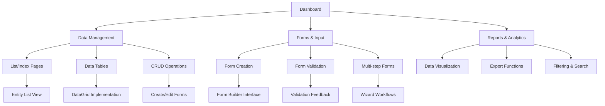
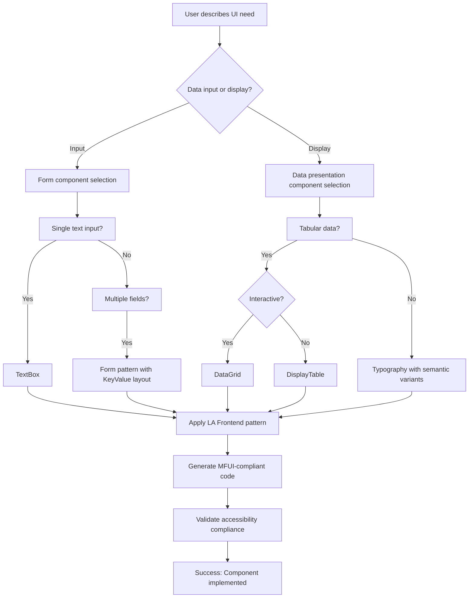

# {{project_name}} UI/UX Specification

This document defines the user experience goals, information architecture, user flows, and visual design specifications for your project's user interface using MoneyForward's MFUI React component library. It serves as the foundation for MFUI-compliant frontend development, ensuring consistency with MoneyForward's design system and proven patterns from LA Frontend implementations.

## Overall UX Goals & Principles

### Target User Personas

**Primary Users:** Product Managers and Product Owners
- Need rapid prototype validation and component selection guidance
- Prefer proven patterns over custom design solutions
- Value speed of implementation and MoneyForward design consistency

**Secondary Users:** Frontend Developers
- Require clear component specifications and usage patterns
- Need accessible, semantic HTML structures
- Value maintainable code with established patterns

**Tertiary Users:** UX Designers
- Need design system compliance and consistency
- Require component-driven design decisions
- Value accessibility and user task completion

### Usability Goals

- **Component Discovery:** Users can quickly identify appropriate MFUI components for their needs within 2 minutes
- **Pattern Application:** Developers can implement proven LA Frontend patterns without custom CSS
- **Design Consistency:** All interfaces automatically comply with MoneyForward design standards
- **Accessibility Compliance:** WCAG 2.2 Level A compliance achieved through semantic MFUI component usage
- **Task Completion:** Users complete their primary tasks with minimal cognitive load

### Design Principles

1. **Component Selection Over Custom Design** - Use proven MFUI components instead of creating new ones
2. **Pattern Reuse from LA Frontend** - Leverage successful implementations from real MoneyForward products  
3. **Semantic Component Choice** - Select components based on meaning and function, not appearance
4. **Task Completion Focus** - Prioritize user task completion over aesthetic innovation
5. **MoneyForward Consistency** - Maintain design system compliance across all recommendations

### Change Log

| Date | Version | Description | Author |
|------|---------|-------------|---------|
| 2025-01-14 | 1.0 | Initial MFUI frontend specification | Maya (MFUI UX Expert) |

## Information Architecture (IA)

### Site Map / Screen Inventory

### Navigation Structure

**Primary Navigation:** Main application sections accessible through `MainNavigation` component with consistent MoneyForward branding via `GlobalHeader`

**Secondary Navigation:** Section-specific navigation using `SubNavigation` component for contextual workflows and related functionality

**Breadcrumb Strategy:** Clear hierarchical navigation using `TextLink` components with semantic spacing, following LA Frontend breadcrumb patterns

## User Flows

### Flow: Component Selection & Implementation

**User Goal:** Select appropriate MFUI components and implement proven patterns for specific use cases

**Entry Points:** 
- Component guidance requests
- Pattern analysis requirements  
- Frontend specification creation

**Success Criteria:** 
- Appropriate MFUI components identified
- LA Frontend patterns applied
- MoneyForward design consistency maintained

#### Flow Diagram

#### Edge Cases & Error Handling:
- Custom component requests → Redirect to existing MFUI alternatives
- Accessibility violations → Provide WCAG-compliant MFUI solutions
- Design system deviations → Enforce MoneyForward design token usage
- Performance concerns → Recommend optimized MFUI component patterns

**Notes:** This flow emphasizes systematic component selection using the MFUI decision tree, ensuring consistency with proven LA Frontend patterns while maintaining accessibility and performance standards.

## Wireframes & Mockups

**Primary Design Files:** MFUI component documentation and LA Frontend pattern library serve as the primary design reference, eliminating the need for separate wireframe tools

### Key Screen Layouts

#### List/Index Page Layout

**Purpose:** Display collections of data with filtering, sorting, and actions following LA Frontend proven patterns

**Key Elements:**
- `PageLayout` with `PageLayout.Header` containing title and primary action
- `DataGrid` with edge-to-edge layout for data presentation
- `Button` components for primary actions and navigation
- Empty state handling with `EmptyContentMessage`
- Loading states using `Skeleton` components

**Interaction Notes:** 
- Primary action button in header (typically "Add New")
- Back navigation to parent section
- Row-level actions within data grid
- Responsive behavior for mobile displays

**Design File Reference:** LA Frontend `pages/account-patterns/ui/account-patterns-template.tsx`

#### CRUD Form Layout  

**Purpose:** Create and edit entity forms with validation using proven form patterns

**Key Elements:**
- `KeyValue` layout for consistent field presentation (160px labels, flexible content)
- `TextBox`, `SelectBox`, and specialized input components
- `HelpMessage` for validation feedback
- `ConfirmEditingFormModal` for unsaved changes protection
- Action buttons with loading states

**Interaction Notes:**
- Form validation with inline error messages
- Required field indicators
- Cancel/Save actions with confirmation dialogs
- Auto-save capabilities where appropriate

**Design File Reference:** LA Frontend `features/account-pattern/ui/account-patterns-form.tsx`

## Component Library / Design System

**Design System Approach:** MoneyForward MFUI React component library with full UIDS v2 compliance, providing 50+ semantic components with built-in accessibility and consistent design tokens

### Core Components

#### Layout Components

**Purpose:** Structural components for consistent page organization and spacing

**Variants:** 
- `Panel` for grouped content sections
- `VStack`/`HStack` for semantic spacing
- `PageLayout` for standard page structure
- `KeyValue` for form-like data display

**States:** Default layout states with responsive behavior

**Usage Guidelines:** Always use Stack components with semantic spacing tokens instead of custom CSS. Follow LA Frontend layout patterns for consistency.

#### Form Components  

**Purpose:** Data input components with built-in validation and accessibility

**Variants:**
- `TextBox` for single-line text input
- `MultilineTextBox` for longer content
- `SelectBox` for single selection
- `MultipleSelectBox` for multi-selection
- `DatePicker`/`MonthPicker` for date selection
- `Checkbox`/`RadioButton` for boolean choices

**States:** Default, focused, error, disabled, loading

**Usage Guidelines:** Use semantic component selection based on data type and user interaction patterns. Always include proper labels and validation feedback.

#### Data Display Components

**Purpose:** Information presentation with semantic meaning and consistent styling

**Variants:**
- `DataGrid` for interactive tables
- `DisplayTable` for read-only data
- `Typography` with semantic variants
- `Badge`/`Tag` for status indication
- `StatusLabel` for state communication

**States:** Loading (`Skeleton`), empty (`EmptyContentMessage`), error (`SectionMessage`)

**Usage Guidelines:** Choose components based on data complexity and user interaction needs. Follow LA Frontend table patterns for consistent data presentation.

## Branding & Style Guide

### Visual Identity

**Brand Guidelines:** MoneyForward design system with MFUI design tokens ensuring consistent visual identity across all MoneyForward products

### Color Palette

| Color Type | Hex Code | Usage |
|------------|----------|--------|
| Primary | blue-49 | Primary actions, active states, brand elements |
| Secondary | blue-38 | Hovered states, secondary actions |
| Accent | blue-28 | Pressed states, emphasis |
| Success | green signal | Positive feedback, confirmations, success states |
| Warning | yellow signal | Cautions, important notices, attention needed |
| Error | red signal | Errors, destructive actions, validation failures |
| Neutral | Grayscale system | Text, borders, backgrounds, disabled states |

### Typography

#### Font Families
- **Primary:** System font stack with optimized fallbacks for performance
- **Secondary:** Same system stack for consistency
- **Monospace:** Monospace stack for code and technical content

#### Type Scale

| Element | Size | Weight | Line Height |
|---------|------|---------|-------------|
| H1 | page-heading-1 | bold | optimized |
| H2 | section-heading | medium | optimized |
| H3 | content-heading | medium | optimized |
| Body | body | regular | optimized |
| Small | help-message | regular | compact |

### Iconography

**Icon Library:** MFUI integrated icon system with consistent sizing and semantic meaning

**Usage Guidelines:** Use icons to enhance understanding, not replace text. Maintain consistent icon sizing within component contexts.

### Spacing & Layout

**Grid System:** CSS Grid with semantic spacing tokens for consistent layouts

**Spacing Scale:** 
- Horizontal: 14px base with fractional variants (0.25x, 0.5x, 1.5x, 2x)
- Vertical: 24px base with semantic naming (paragraph.vertical, section.vertical, container.vertical)

## Accessibility Requirements

### Compliance Target

**Standard:** WCAG 2.2 Level A compliance achieved through semantic MFUI component usage and proper implementation patterns

### Key Requirements

**Visual:**
- Color contrast ratios: Automated compliance through MFUI design tokens
- Focus indicators: Built-in focus management in all interactive components
- Text sizing: Responsive typography with user preference respect

**Interaction:**
- Keyboard navigation: Full keyboard support in all MFUI components
- Screen reader support: Semantic HTML with proper ARIA attributes
- Touch targets: Minimum 44px touch targets on mobile devices

**Content:**
- Alternative text: Required for all images and icons
- Heading structure: Proper heading hierarchy (H1-H6) for navigation
- Form labels: Associated labels for all form inputs with `HelpMessage` for errors

### Testing Strategy

Automated accessibility testing through MFUI component compliance, with manual testing using screen readers and keyboard-only navigation to validate user experience quality.

## Responsiveness Strategy

### Breakpoints

| Breakpoint | Min Width | Max Width | Target Devices |
|------------|-----------|-----------|----------------|
| Mobile | 0px | 767px | Smartphones, mobile browsers |
| Tablet | 768px | 1023px | Tablets, small laptops |
| Desktop | 1024px | 1439px | Standard desktop displays |
| Wide | 1440px | - | Large displays, external monitors |

### Adaptation Patterns

**Layout Changes:** Stack components automatically adjust spacing for mobile viewports, DataGrid components provide horizontal scrolling for table overflow

**Navigation Changes:** MainNavigation collapses to mobile-friendly patterns, SubNavigation adapts to smaller screen hierarchies

**Content Priority:** Progressive disclosure prioritizes essential content on smaller screens, secondary actions move to overflow menus

**Interaction Changes:** Touch-friendly targets automatically scale, hover states adapt appropriately for touch devices

## Animation & Micro-interactions

### Motion Principles

Subtle, purposeful motion that enhances usability without distraction. All animations respect user preferences for reduced motion and maintain 60fps performance.

### Key Animations

- **Component State Transitions:** Smooth transitions between component states (Duration: 200ms, Easing: ease-in-out)
- **Page Transitions:** Subtle page navigation feedback (Duration: 300ms, Easing: ease-out)  
- **Loading States:** Progressive loading indicators with skeleton components (Duration: 1.5s loop, Easing: linear)
- **Focus Indicators:** Clear focus ring animations (Duration: 150ms, Easing: ease-in-out)
- **Toast Notifications:** Slide-in feedback messages (Duration: 250ms, Easing: ease-out)

## Performance Considerations

### Performance Goals

- **Page Load:** Initial render under 2 seconds with MFUI component lazy loading
- **Interaction Response:** Sub-200ms response for all user interactions
- **Animation FPS:** Consistent 60fps for all transitions and micro-interactions

### Design Strategies

Leverage MFUI component optimization patterns including built-in lazy loading, efficient CSS Modules, and semantic HTML structure. Use DataGrid virtualization for large datasets and Skeleton loading states for perceived performance improvements.

## Next Steps

### Immediate Actions

1. Review component selections with development team for technical feasibility
2. Validate MFUI component availability and licensing requirements  
3. Create development environment with MFUI library integration
4. Establish frontend architecture following LA Frontend patterns
5. Set up accessibility testing workflow with MFUI compliance validation

### Design Handoff Checklist

- [x] All user flows documented with MFUI component specifications
- [x] Component inventory complete with semantic usage guidelines
- [x] Accessibility requirements defined through WCAG 2.2 compliance
- [x] Responsive strategy clear with breakpoint specifications
- [x] Brand guidelines incorporated via MoneyForward design tokens  
- [x] Performance goals established with MFUI optimization patterns

## Checklist Results

*This section will be populated when a UI/UX compliance checklist is executed against this specification document.*

---

*Generated by Maya (MFUI UX Expert) using MoneyForward design system patterns and LA Frontend proven implementations*